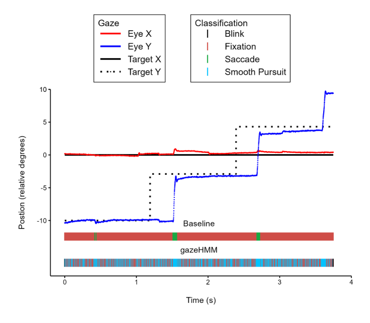
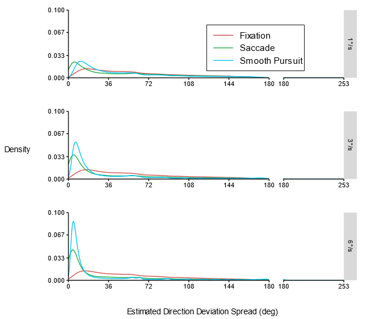

# pusuing-smooth-pursuits-poster
This repository contains my final report for the research master internship 2023 at University of Amsterdam and the corresponding poster. 
Additionally, I summarize some of the findings below. My supervisors for this internship were [Ingmar Visser](https://www.uva.nl/profiel/v/i/i.visser/i.visser.html) and [Simon Kucharský](https://www.uva.nl/en/profile/k/u/s.kucharsky/s.kucharsky.html)

# File overview
- *PSP_report.pdf* - My final internship report 
- *PSP_poster.pdf* - The poster presented on the poster conference 

# Abstract
Human experts and classification algorithms often confuse fixations (fixating stationary targets) and smooth pursuits (fixating moving targets) because their feature characteristics overlap. To investigate the gazeHMM algorithm by Lüken et al. (2022) and to explore better features, I created a ground truth data set that does not rely on human annotation. The data set consists of almost four hours of eye movements. Ten participants fixated different targets designed to induce saccades, fixations, and smooth pursuits. Ground truth was established by avoiding fixations and smooth pursuits to cooccur and separating them from saccades by their velocity. Visual inspection revealed that gazeHMM confused fixations and smooth pursuits likely because their velocity, acceleration, and sample-to-sample angle were distributed similarly. In contrast, I developed two features based on findings that directions within smooth pursuits are more similar than within fixations. The estimated direction deviation and estimated direction deviation spread clearly distinguished between fixations and smooth pursuits in the current data set. Therefore, they could likely improve the automatic classification of these eye movements, which is particularly relevant for the study of cognition and neurodegenerative diseases.

# Summary of results
The following is a short overview of the results but I strongly encourage you to read the full paper for all results and better context.

## Benchmark data without human annotation
We collected almost four hours of eye movements from ten fellow research master students at the University of Amsterdam. Each participant went through 144 trials in which they had to fixate a (moving) dot. Between trials we manipulated the speed (1, 3, and 6 degrees per seconds), the trajectory (horizontal- lefgt/right, vertical- up/down, diagonal- left/right and up/down) and the movement pattern (jumping circles, moving circles, back-and-forth circles). Each participant saw each combination of these factors twice for a total of 144 trials (3x3x8x2). As the dataset is partially meant for algorithm development, we randomly split participants between a training (n = 7) and test set (n=3). The following results are based on the seven participants in the training set. 

Like algorithms, human experts often struggle to distinguish smooth pursuits from other eye movements and it is questionable whether their annotations represent a true gold standard (Andersson et al., 2017; Hooge et al., 2018). Therefore, we designed three different stimuli to evoke specific eye movements. Specifically, we manipulated each trial such that only one type of slow eye movement (i.e., fixations or smooth pursuits) and saccades - fast eye movements - could cooccur. Subsequently, we distinguished slow and fast eye movements based on dynamic velocity thresholds to create benchmark labels without relying on human annotation. This procedure is not perfect and limitations are discussed in the paper. However, there is strong evidence - also discussed in the paper - that the manipulation and subsequent classification were sucessful. Below are three videos, illustrating the different types of stimuli. 

Note that these videos were captured on a different monitor from the one used during the study and cropped. Additionally, frames were lost during video capturing. Thus, these videos are not representative of the true conditions during the study and are only supposed to illustrate the three different movement patterns we used. 

https://github.com/lukekorthals/pusuing-smooth-pursuits-poster/assets/55378727/78961f78-115b-45d1-8c9d-8897d96319c3

*Note.* This video shows the jumping circle stimulus at 3 degrees per second on a horizontal trajectory from left to right. This stimulus was supposed to evoke a series of fixations and saccades. 

https://github.com/lukekorthals/pusuing-smooth-pursuits-poster/assets/55378727/39b46c37-ff49-49de-9cba-9985bdd6d373

*Note.* This video shows the moving circle stimulus at 3 degrees per second on a horizontal trajectory from left to right. This stimulus was supposed to evoke consistent smooth pursuits.

https://github.com/lukekorthals/pusuing-smooth-pursuits-poster/assets/55378727/98153e76-0d3f-4f07-be94-ea1f03cfc60e

*Note.* This video shows the back-and-forth circle stimulus at 3 degrees per second on a horizontal trajectory from left to right. This stimulus was supposed to evoke a series of smooth pursuits and saccades.

## Recent event classifcation algorithms fail to distinguish fixations and smooth pursuits
Consistent with findings by Lüken et al. (2022), their recent event classification algorithm gazeHMM failed to reliably distinguish fixations from smooth pursuits and rapidly switched between them in the current data set. The plot below shows one example of this and more are reported in the paper. 

*Note.* This plot shows trial 126 for participant f7bb2338. In this jumping circle trial, the target jumped 6° at 1000ms intervals along a vertical trajectory from the bottom to the top. According to the baseline this was a clear series of fixations and saccades. gazeHMM classified no saccades and switched rapidly between fixations and smooth pursuits.

## gazeHMM features have similar distributions for fixations and smooth pursuits
The velocity, acceleration, and sample-to-sample angles of fixations and smooth pursuits are distributed very similarly. As gazeHMM relies on these three features to classify different eye movements, this overlap likely explains why it fails at reliably classifying them. This is especially the case for slow smooth pursuits (1 and 3 degrees per second). As an example, the plot below shows the velocity of fixations and smooth pursuits across all trials of a given speed of all participants in the training set. For all target speeds, there is a lot of overlap but less so for faster target speeds. This explains, why algorithms particularly struggle with slow smooth pursuits. 

*Note.* These plots show velocity densities for fixations (red), and smooth pursuits (blue) for targets moving 1°/s (top), 3°/s (middle), and 6°/s (bottom). They are based on all 336 trials of a given speed included in the training set. Distributions for fixations and smooth pursuits are very similar, but less so for faster targets. 
The x axes are broken to focus the plots on the area where most densities are.

## New features based on the direction deviation look promising
Based on exploratory findings by Startsev et al. (2019) we developed two new features. The estimated direction deviation (EDD) and estimated direction deviation spread (EDD-S) are based on the idea that smooth pursuits follow a consistent trajectory from which the angles of individual samples deviate less than fixations which should be relatively randomly distributed. Both features show less overlap for fixations and smooth pursuits and thus are promising candidates to improve gazeHMM by Lüken et al. (2022) or to be used in novel algorithms. The plot below shows the distribution of the EDD-S feature at different target speeds for all trials in the training set. As can be seen, the overlap between fixations and smooth pursuits is less than on the velocity feature above especially for faster smooth pursuits. I highly encourage to have a look at the paper for a more detailed explanation of these features.

*Note.* These plots show estimated direction deviation spread densities for fixations (red), and smooth pursuits (blue) for targets moving 1°/s (top), 3°/s (middle), and 6°/s (bottom). They are based on all 336 trials of a given speed included in the training set. Distributions for fixations are clearly distinct from those of saccades and smooth pursuits for all target speeds.
The x axes are broken to focus the plots on the area with the highest densities.

# References
- Andersson, R., Larsson, L., Holmqvist, K., Stridh, M., & Nyström, M. (2017). One algorithm to rule them all? An evaluation and discussion of ten eye movement event-detection algorithms. Behavior Research Methods, 49(2), 616–637. https://doi.org/10.3758/s13428-016-0738-9
- Hooge, I. T. C., Niehorster, D. C., Nyström, M., Andersson, R., & Hessels, R. S. (2018). Is human classification by experienced untrained observers a gold standard in fixation detection? Behavior Research Methods, 50(5), 1864–1881. https://doi.org/10.3758/s13428-017-0955-x
- Lüken, M., Kucharský, Š., & Visser, I. (2022). Characterising eye movement events with an unsupervised hidden markov model. Journal of Eye Movement Research, 15(1), Article 1. https://doi.org/10.16910/jemr.15.1.4
- Startsev, M., Agtzidis, I., & Dorr, M. (2019). 1D CNN with BLSTM for automated classification of fixations, saccades, and smooth pursuits. Behavior Research Methods, 51(2), 556–572. https://doi.org/10.3758/s13428-018-1144-2
